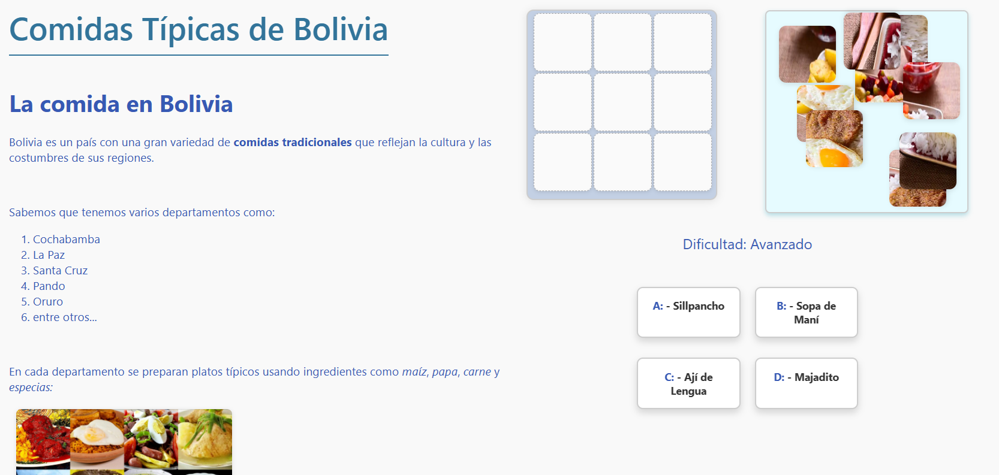
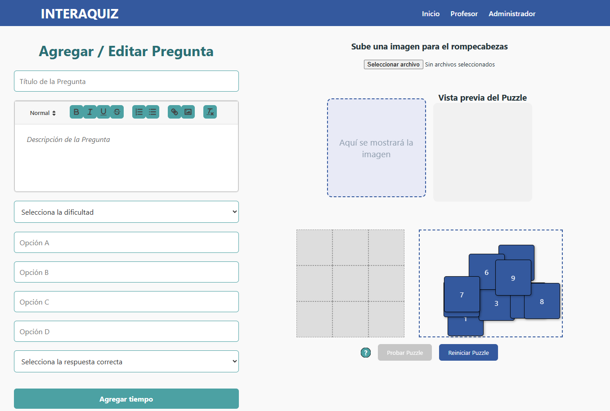

# INTERAQUIZ - Editor de Preguntas Interactivas

## Versión 1.1

## Descripción
**Interaquiz** es una aplicación web interactiva que permite a docentes crear, editar y gestionar preguntas tipo rompecabezas a partir de imágenes. El objetivo es facilitar el aprendizaje lúdico y visual en entornos educativos, haciendo que el proceso de responder preguntas sea más atractivo para estudiantes.

- Sistema orientado a la gamificación y actividades dinámicas.
- Cada pregunta integra un rompecabezas visual que el usuario debe armar para responder.
- Pensado para profesores de nivel escolar y preuniversitario.

## Características principales
- Editor visual de preguntas y respuestas con imágenes.
- Soporte para puzzles y validación de respuestas.
- Acceso multiusuario (profesor, administrador).
- Backend en Python (Flask) y frontend HTML, CSS y JS vanilla.
- Almacenamiento de datos en MongoDB Atlas (cloud).
- Exposición del sitio web a internet mediante Ngrok.

## Capturas de Pantalla

<p align="center">
  
  
</p>

## Documentación y Manual de Instalación

Para ver el **manual de instalación completo y detallado** revisa el archivo [INSTALL.md](./INSTALL.md).

## Estructura del Proyecto

```text
/pweb/
├── assets/
│   ├── icons/
│   └── images/
├── css/
│   └── ver-preguntas.css
├── docs/
├── js/
│   ├── app.js
│   ├── ver-preguntas.js
│   └── ...
├── views/
│   ├── ver-preguntas.html
│   ├── editor-preguntas.html
│   └── ...
├── server.py
├── requirements.txt
├── .env.example
├── INSTALL.md
└── README.md
